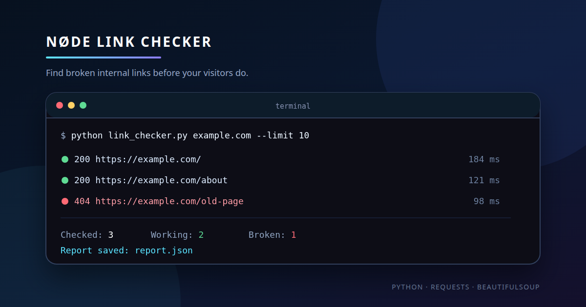

<div align="center">

# NØDE Link Checker

### Find broken internal links before your visitors do.

[](https://www.python.org/)
[](https://requests.readthedocs.io/)
[](https://www.crummy.com/software/BeautifulSoup/)
[](https://github.com/NODEPY/node-link-checker/actions/workflows/python-check.yml)
[](LICENSE)

</div>



NØDE Link Checker is a small Python CLI that crawls one website, checks its
internal links and shows which pages work, redirect or return an error.

It is read-only: the script sends normal HTTP requests and never changes the
website.

## Features

- Crawls links from the same website
- Detects `404`, `500`, timeouts and connection errors
- Shows response time and redirects
- Ignores duplicate links, fragments, email and phone links
- Skips external websites
- Streams responses and limits downloaded HTML to 2 MB per page
- Configurable page limit, timeout and request delay
- Optional JSON report
- Returns exit code `1` when broken links are found, so it can be used in CI
- No browser or account required

## Installation

Clone the repository:

```bash
git clone https://github.com/NODEPY/node-link-checker.git
cd node-link-checker
```

Create a virtual environment:

```bash
python3 -m venv .venv
source .venv/bin/activate
```

Install dependencies:

```bash
pip install -r requirements.txt
```

## Usage

Check up to 30 pages:

```bash
python link_checker.py example.com
```

Check a larger website and save a JSON report:

```bash
python link_checker.py https://example.com --limit 100 --output report.json
```

Use a custom timeout and delay:

```bash
python link_checker.py example.com --timeout 5 --delay 0.3
```

Show only the final summary:

```bash
python link_checker.py example.com --quiet
```

Example output:

```text
✅ 200  https://example.com/ (184 ms)
✅ 200  https://example.com/about (121 ms)
❌ 404  https://example.com/old-page (98 ms)

Результат:
Перевірено: 3
Працює: 2
Битих: 1
Редиректів: 0
Зовнішніх пропущено: 1

📄 Звіт збережено: report.json
```

## How it works

1. Downloads the starting page.
2. Extracts links from `<a href="...">` elements.
3. Keeps only links from the same website.
4. Checks each unique page once.
5. Prints a summary and optionally writes a JSON report.

The script stops when there are no new pages or when it reaches `--limit`.

## Exit codes

| Code | Meaning |
| --- | --- |
| `0` | All checked links work |
| `1` | At least one broken link was found |
| `2` | The starting URL is invalid |
| `130` | The check was stopped with `Ctrl+C` |

## Tests

Run the test suite:

```bash
python -m unittest discover -s tests -v
```

The tests use fake HTTP responses, so they do not depend on an external website.

## Responsible use

Use the checker on websites you own or are allowed to test. Keep a reasonable
`--limit` and `--delay` for larger websites.

An example of the JSON format is available in
[`examples/report.example.json`](examples/report.example.json).
